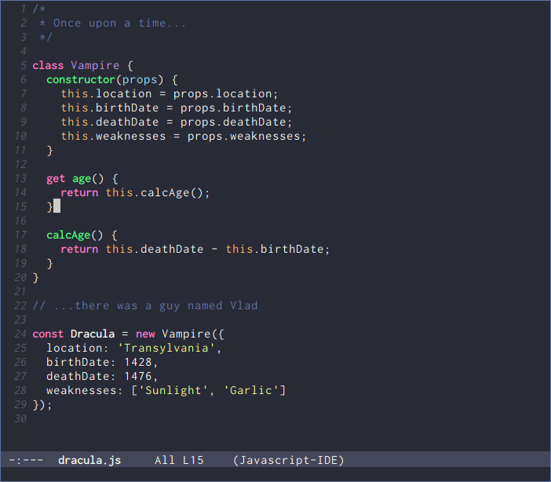

# Dracula for [Emacs](https://www.gnu.org/software/emacs/)

> A dark theme for [Emacs](https://www.gnu.org/software/emacs/).



## Install


All instructions can be found at
[draculatheme.com/emacs](https://draculatheme.com/emacs).

## Configure

Some aspects of this theme are customizable.  You can change them either
by doing `M-x customize-group dracula` or setting one or more of the
following values in your Emacs init file.  Note that these variables
need to be set before `load-theme` is invoked for Dracula.

```
;; Don't change the font size for some headings and titles (default t)
(setq dracula-enlarge-headings nil)

;; Adjust font size of titles level 1 (default 1.3)
(setq dracula-height-title-1 1.25)

;; Adjust font size of titles level 2 (default 1.1)
(setq dracula-height-title-1 1.15)

;; Adjust font size of titles level 3 (default 1.0)
(setq dracula-height-title-1 1.05)

;; Adjust font size of document titles (default 1.44)
(setq dracula-height-doc-title 1.4)

;; Use less pink and bold on the mode-line and minibuffer (default nil)
(setq dracula-alternate-mode-line-and-minibuffer t)
```

## Test

This repository contains a small script named `start_emacs_test.sh`,
which helps you to test this color theme in various environment
(graphical, 256+ colors terminals, 16 colors terminals).

    # Graphical test
    ./start_emacs_test.sh

    # Full color terminal
    ./start_emacs_test.sh -nw 256

    # TTY like env
    ./start_emacs_test.sh -nw 16

This script requires the xterm terminfo files.

## Team

This theme is maintained by the following person(s) and a bunch of
[awesome contributors](https://github.com/dracula/emacs/graphs/contributors).

[](https://github.com/film42) | [](https://github.com/milouse) |
--- | --- |
[Garrett T](https://github.com/film42) | [Étienne D](https://github.com/milouse) |

## License

[MIT License](./LICENSE)
